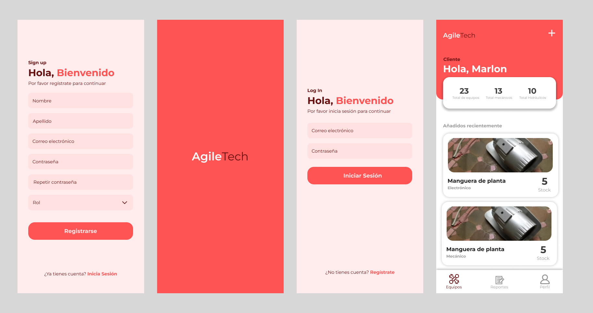

# Agile Tech

An app for equipment and reports management.

## Getting Started

This project is a starting point for a Flutter application.

## UI proposal




## Getting Started

To run this project first you need prepare your backend environment, this one can be found here in this repo: 
[Backen Repo](https://github.com/R-Berrocal/backend-challenge-agiletech)

There you'll find all the steps to get started with it.

Once the backend is running succesfully the only change you need to take is inside the the file at this path:

[Link Text](lib/services/graphql_config.dart) here change the base IP address to your own IP address in your specific LAN connection you can achieve that by running:

```bash
ipconfig
```

After that just select the option that says "IPv4 Address". Once you have that the project should run succesfully on your emulator or physical phone!